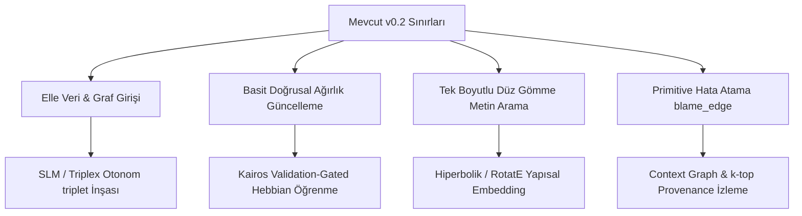

# Goldorn Projesi Derin Analiz Raporu: Bilgi Grafiği ve Dağıtık Yapay Zeka Mimarisi
**Araştırma Belgelerinin "Y = f(X, Graph)" Tezi Açısından Değerlendirilmesi ve Mimari Yol Haritası**

---

## 1. Giriş ve Yönetici Özeti

Bu raporda, Goldorn projesinin asıl sorusuna — **"Graph tabanlı öğrenme, weight matrislerinin alternatifi olabilir mi?"** — yanıt aramak üzere gerçekleştirilen 8 derin araştırma (deep search) raporu okunmuş, sentezlenmiş ve Goldorn mimarisi (v0.2) çerçevesinde kapsamlı bir değerlendirmeye tabi tutulmuştur.

### Ana Bulgular ve Stratejik Karar:
1. **Ağırlık Matrislerinin Birebir Alternatifi Olma Sorusu:** Araştırmalar net bir şekilde göstermektedir ki, saf sembolik veya tamamen ayrık graf yapıları, LLM'lerin parametrik (ağırlık matrislerinde saklı) anlamsal temsil ve genelleme yeteneğinin tek başına bir alternatifi **olamaz**. Ancak, 2025-2026 yapay zeka literatürünün üzerinde birleştiği konsensüs, **Çift Kanallı (Dual-Channel) Hibrit Nöro-Sembolik** yapılardır. Ağırlık matrisleri "Sistem 1" (hızlı, sezgisel, anlamsal) işlevini görürken; açık, öğrenilebilir ve dinamik grafik yapıları "Sistem 2" (mantıklı, doğrulanabilir, sürekli güncellenebilir dış bellek) işlevini üstlenmektedir.
2. **Goldorn'un Konumu:** Goldorn basit bir kişisel bilgi yönetim aracı (Obsidian+AI) olmaktan çıkarılıp, **Ted Nelson'ın Xanadu** projesinin vizyonu doğrultusunda dağıtık sistemlerde çalışan, donanıma (fiziksel GPU) mahkum kalmadan bilgi transferi yapabilen otonom bir AI bellek katmanına dönüştürülebilir.
3. **Mevcut v0.2 Sınırları ve Değişim Gereksinimi:** Mevcut mimarideki "verinin elle girilmesi/grafın elle çizilmesi" ve "basit doğrusal sönümleme (decay)" kısıtları projenin büyümesi önündeki en büyük engellerdir. Bu raporda sunulan 7 aşamalı otonom inşa hattı, *Kairos* doğrulama kapılı Hebbian öğrenme kuralları ve *CLAUSE* çoklu ajan mimarisiyle Goldorn'un temelleri sarsılmaz bir şekilde yeniden kurulacaktır.

---

## 2. Derin Araştırma Raporlarının Karşılaştırmalı Analizi ve Goldorn İzdüşümü

### Rapor 1: Automated Knowledge Graph Construction (Otomatik KG İnşası)
*   **Özet:** Geleneksel üç katmanlı (ontoloji mühendisliği, NER, bilgi füzyonu) süreçlerin yerini LLM destekli, uçtan uca küçük neural modeller (SLM) ve denetimsiz şema türetimi (unsupervised schema induction) almıştır. Triplex (3.8B, DPO/KTO ile eğitilmiş triplet çıkarıcı) ve ReLiK (Retriever-Reader ile hızlı entity linking) modelleri maliyeti %98 düşürmüştür.
*   **Goldorn İzdüşümü:** Goldorn'un en zayıf halkası olan "elle veri girişi/graf çizimi", Triplex veya ReLiK tabanlı lokal bir SLM ile otomatikleştirilmelidir. Sokratik sorgulama (SocraticKG - 5W1H) yöntemiyle metinlerden çıkarılan ilişkilerdeki zamansal ve nedensel kayıplar önlenmelidir.

### Rapor 2: Continual Knowledge Graph Learning (Sürekli KG Öğrenmesi)
*   **Özet:** Grafik sinir ağları (GNN) ve KGE modellerinde yeni bilgi eklenmesi "yıkıcı unutmaya" (catastrophic forgetting) neden olur. Çözüm olarak EWC (Regularization), IncLoRA (Parameter Isolation) ve BAKE (Bayesian-Guided posterior updates) önerilmektedir. Biyolojik tarafta ise *Kairos* mimarisi (LTP güçlendirme, LTD zamansal sönümleme ve doğrulanmış emergent bağlantı) ve *Phasor Agents* (uyku rezonansı konsolidasyonu) öne çıkmaktadır.
*   **Goldorn İzdüşümü:** Goldorn'un mevcut `update_weight` kuralı yerine, *Kairos* tarzı **Doğrulama Kapılı Hebbian Öğrenme (Validation-Gated Learning)** ve *BAKE* tarzı Bayesyen sürekli güncelleme entegre edilmelidir. Ağırlık güncellemeleri kontrolsüz yapılmamalı, mantıksal tutarlılık ve anlamsal yenilik süzgecinden (Validation Gate) geçmelidir.

### Rapor 3: Differentiable Knowledge Graph Research (Türevlenebilir KG)
*   **Özet:** Discrete (SPARQL/SQL) graf işlemlerini sürekli vektör uzayına taşıyarak gradient-based optimizasyona uyumlu hale getiren TensorLog, ReifiedKB ve Neural LP gibi yapılar incelenmiştir. Ancak bu yapılarda "Fuzzy Address Leakage" (3 hoptan sonra anlamsal dağılma) ve "Closed-Schema Bottleneck" (yeni ilişki türü eklenince relation decoder'ın çökmesi) gibi kronik zayıflıklar vardır. KG-Flex, ilişkileri natural-language embedding uzayına çözerek sıfır atışlı (zero-shot) reasoning sağlar.
*   **Goldorn İzdüşümü:** Goldorn'un ayrık (discrete) çok adımlı arama mimarisi gradient bazlı olmadığı için "fuzzy address leakage" riskinden muaftır, bu büyük bir avantajdır. Ancak ilişkilerin katı kısıtlarını aşmak için *KG-Flex* mantığıyla ilişkileri doğrudan anlamsal embedding uzayında eşleştirmeliyiz.

### Rapor 4: Credit Assignment for Graph-Based AI (Hata Atama)
*   **Özet:** Graf tabanlı çıkarımlarda hatanın kaynağını (flawed node veya faulty edge) bulma problemidir. GNN açıklayıcıları (GCFX - karşıolgusal analiz, SAME - Shapley değerleri) ve neuro-symbolic *Context Graph* (kararlar, kurallar ve kanıtlar arası telemetry ağı) bu sorunu çözer.
*   **Goldorn İzdüşümü:** Mevcut `blame_edge` fonksiyonumuz (en yüksek katkılı edge'i cezalandırma) geliştirilmeli ve **Context Graph** altyapısıyla desteklenmelidir. Sistem sadece edge cezalandırmamalı, LLM'in kendisini debug etmesini sağlayan *InT (Internal Telemetry)* tarzı "self-proposed interventions" (kendi kendine müdahale önerileri) getirilmelidir.

### Rapor 5: Lessons from the Stall of Cyc and NELL (Cyc ve NELL Hataları)
*   **Özet:** Cyc'in el yapımı ontolojileri "ontolojik borç" (ontological debt) ve "mantıksal kısıt patlaması" nedeniyle kilitlenmiştir. NELL ise internetten kontrolsüz beslendiği için "hata kaskadı" (error cascade) yaşamış ve çöplüğe dönmüştür. Çözüm: Asla kaynağa ve çıktıya koşulsuz güvenmeme, mikro-teoriler (localized context), dinamik şema evrimi ve kontrol teorisi tabanlı kendi kendini düzeltme döngüleridir.
*   **Goldorn İzdüşümü:** Goldorn asla tek bir monolitik KB olmamalıdır. Dağıtık web düğümlerinde mikro-teoriler (Cyc'in Microtheories yaklaşımı) halinde izole edilmelidir. NELL'in yaşadığı hata kaskadını engellemek için her yeni bilginin kaynağını (provenance) ve güven skorunu asenkron doğrulayıcılarla denetlemeliyiz.

### Rapor 6: KGE Models for Personal Knowledge Systems (KGE Modelleri)
*   **Özet:** TransE (hızlı ama transistivity ve 1-to-N'de zayıf), RotatE (kompleks rotasyon, symmetry/composition'da iyi ama transitivity'de zayıf), BoxE (geometrik alanlar, kurallarda iyi) ve Hyperbolic (hiyerarşik yapılarda mükemmel) modelleri kıyaslanmıştır.
*   **Goldorn İzdüşümü:** Goldorn'da sadece düz metin benzerliği (cosine) yerine, bilginin hiyerarşik doğasını yakalamak adına **Hyperbolic (Hiperbolik) veya RotatE-tabanlı yapısal gömmeler (structural embeddings)** kullanılmalıdır. Bu sayede "is-a", "part-of" gibi hiyerarşik geçişler matematiksel olarak doğru temsil edilir.

### Rapor 7: Neuro-Symbolic AI Research 2026 (Nöro-Sembolik Yapay Zeka)
*   **Özet:** *CLAUSE* mimarisi, graf inşasını bütçe ve token maliyetine göre optimize eden 3 ajanlı (Subgraph Architect, Path Navigator, Context Curator) bir yapıdır. IBM'in *Logical Neural Networks (LNN)* yapısı her nöronu birinci dereceden mantık operatörüyle (AND, OR) eşleştirerek mutlak şeffaflık sunar. *ULTRA* ise ilişkilerin topolojisini öğrenerek tamamen sıfır atışlı (zero-shot) transfer sağlar.
*   **Goldorn İzdüşümü:** Token patlamasını ve anlamsal gürültüyü önlemek için Goldorn arama motoru, *CLAUSE* mimarisindeki gibi **bütçe duyarlı alt-graf ajanları** (Lagrangian kısıtlamalı) ile güncellenmelidir.

### Rapor 8: Proving a PKG Learns (PKG Öğreniminin Ölçülmesi)
*   **Özet:** Bir PKG'nin gerçekten öğrenip öğrenmediğini kanıtlamak için *Ablation Studies* (öğrenme döngüsünü kapatıp kıyaslama) ve *Counterfactual Evaluation* (öğrenme olmasaydı ne olurdu analizi) ile Precision@K, Recall@K, nDCG gibi sert metrikler kullanılmalıdır.
*   **Goldorn İzdüşümü:** Goldorn'un gelişimini nesnel olarak göstermek için test scriptlerimize otomatik bir **Ablation & Benchmarking Modülü** eklemeliyiz. Ağırlık güncellemelerinin retrieval kalitesini zaman içinde nasıl artırdığını matematiksel olarak raporlamalıyız.

---

## 3. Goldorn Mimarisinde Güncellenmesi ve Değişmesi Gereken Yerler

Mevcut v0.2 kod tabanı (`knowledge_graph.py`, `auto_topology.py`) incelendiğinde, ciddi bir proje haline gelmesi için değiştirilmesi gereken stratejik alanlar belirlenmiştir:



### 1. Veri Giriş Mimarisi (Elle Girişten Otonom İnşaya)
*   **Değişecek Kısım:** `seed.py` ve `add_chip_domain.py` gibi statik betikler yerine otonom metin okuyucu getirilmelidir.
*   **Yeni Tasarım:** Sisteme beslenen ham markdown veya txt dosyaları, yerel bir **Triplex** (SLM) modeliyle SPO (Subject-Predicate-Object) formatında ayrıştırılmalı ve `knowledge.db` veritabanına otomatik insert edilmelidir. Düğümler arası eşanlamlılık karmaşasını (Ronaldo vs CR7) engellemek için **HDBSCAN + BM25 entegreli Global Canonicalization** aşaması kurulmalıdır.

### 2. Ağırlık ve Öğrenme Kuralı (Basit Kurallardan Kapılı Hebbian Öğrenmeye)
*   **Değişecek Kısım:** `update_weight` fonksiyonunun doğrudan her feedback ile ağırlığı değiştirmesi (NELL'in çöküş nedeni olan hata kaskadına yol açar).
*   **Yeni Tasarım (Kairos Modeli):**
    *   **LTP (Long-Term Potentiation):** Başarılı sorgularda kullanılan ilişkiler güçlendirilir.
    *   **LTD (Long-Term Depression):** Kullanılmayan veya başarısız olan yollar zamansal olarak sönümlenir.
    *   **Validation Gate (Doğrulama Kapısı):** Güncelleme sinyali mantıksal tutarlılık, olgusal temellendirme (grounding) ve anlamsal yenilik süzgecinden geçtikten sonra ağırlık matrisine yansır.

### 3. Arama ve Aktivasyon Motoru (CLAUSE Mimarisi)
*   **Değişecek Kısım:** Mevcut `query` fonksiyonundaki k-hop BFS aramasının kontrolsüz genişlemesi ve dominant domain tespitindeki basit MAX formülü.
*   **Yeni Tasarım:** Token bütçesini ve arama derinliğini yöneten bir **Subgraph Architect** (alt graf mimarı) ve çıkmaza girdiğinde geri dönen (backtracking) **Path Navigator** (yol gezgini) ajanları oluşturulmalıdır. Bu, sorgu gecikmesini ve token harcamasını dramatik şekilde düşürecektir.

### 4. Hata ve Kural Analizi (Context Graph Entegrasyonu)
*   **Değişecek Kısım:** `blame_edge` fonksiyonunun yüzeysel çalışması.
*   **Yeni Tasarım:** Her çıkarım adımını, kullanılan kuralları, LLM kararlarını ve orijinal metin referanslarını (sayfa/koordinat bazında) birbirine bağlayan bir **Context Graph** tablosu kurulmalıdır. Kullanıcı negatif feedback verdiğinde, bu context graf üzerinde *k-top differential provenance* çalıştırılarak en zayıf kanıt zinciri tespit edilip elenmelidir.

---

## 4. Donanımdan Bağımsız Dağıtık LLM & Xanadu AI Stratejisi

Kullanıcının asıl vizyonu: **"Dağıtık sistemlerde - binlerce, belki milyonlarca web sitelerinde LLM işlemlerini yaparak fiziksel GPU gibi donanıma mahkum kalmadan kişisel LLM üretmek."**

Bu vizyonu gerçekleştirmek için araştırmalardan elde edilen mimari altyapı şu şekilde kurgulanabilir:

```
                            [DAĞITIK WEB DÜĞÜMLERİ]
   Düğüm 1 (Web Sitesi A)       Düğüm 2 (Web Sitesi B)       Düğüm 3 (Web Sitesi C)
   ┌────────────────────┐       ┌────────────────────┐       ┌────────────────────┐
   │  Lokal Alt-Graf    │       │  Lokal Alt-Graf    │       │  Lokal Alt-Graf    │
   │  (Mikro-Teori 1)   │       │  (Mikro-Teori 2)   │       │  (Mikro-Teori 3)   │
   └─────────┬──────────┘       └─────────┬──────────┘       └─────────┬──────────┘
             │                            │                            │
             └──────────────────┬─────────┴────────────────────────────┘
                                │ (ULTRA Zero-Shot Topoloji Eşleme)
                                ▼
                   ┌────────────────────────────┐
                   │   LLM Executive Ajan       │ <── (Kullanıcı Sorgusu)
                   │  (Dağıtık Sorgu Yönlendirici)│
                   └────────────────────────────┘
```

### Dağıtık Yapı Nasıl Çalışacak? (GPU Bağımlılığını Kırmak)
1.  **Transclusion (Nelson Prensibi):** Bilgi merkezi bir veritabanında kopyalanarak tutulmaz. Web üzerindeki her site, kendi uzmanlık alanına dair lokal bir alt-graf (Cyc'in **Microtheory** konsepti) barındırır. Bilgi güncellendiğinde, transclusion mantığıyla bu güncel bilgiye referans veren tüm dağıtık düğümler otomatik olarak en güncel veriyi çeker.
2.  **ULTRA Mimarisi ile Zero-Shot Transfer:** Dağıtık sistemlerde her web sitesinin kendi terminolojisi ve sözlüğü olacaktır. ULTRA modelinin yaptığı gibi, düğümler arası anlamsal transferi kelimeler üzerinden değil, **ilişkilerin topolojik geometrisi (Graph of Relations)** üzerinden kuracağız. Bu sayede A sitesinde eğitilen bir mantık yapısı, B sitesine sıfır atışla (zero-shot) transfer edilebilir, yeniden parametre eğitimi veya devasa GPU'lar gerektirmez.
3.  **Differentiable Traversal & Edge Proving:** Sorgu geldiğinde, dağıtık düğümler arasında TensorLog veya ReifiedKB benzeri matris çarpımları yerine, **Phasor Agents** gibi lokal uygunluk izleri (eligibility traces) kullanılarak sadece aktif olan anlamsal yollar uyandırılır. Bu, milyarlarca parametreli bir modeli çalıştırmak yerine, sadece birkaç bin aktif düğüm ve kenarı (CPU milisaniyelerinde) hesaplayarak yanıt üretmeyi sağlar. Devasa GPU'ların forward pass maliyeti, dağıtık CPU'ların lokal graf aktivasyonuna indirgenir.

---

## 5. Eyleme Dökülebilir Yol Haritası ve Mimari Adımlar

Önümüzdeki geliştirme süreçlerinde temelleri sağlamlaştırmak için atılacak teknik adımlar:

### 1. Adım: Veritabanı ve Şema Güncellemesi (SQLite v0.3)
*   **İşlem:** `edge_history` ve `episodes` tablolarının yanına, çıkarım esnasındaki tüm karar adımlarını tutacak `context_graph` tablosunu eklemek.
*   **İlişki Yapısı:** İlişkilere `valid_when` ve `temporal_context` alanları eklenerek zamansal geçerlilik kısıtlarının getirilmesi.

### 2. Adım: Otonom Triplet Çıkarıcı Entegrasyonu
*   **İşlem:** Yerel CPU üzerinde çalışabilen **SciPhi Triplex (3.8B)** veya **ReLiK** API entegrasyonu ile ham metinlerden otonom düğüm ve kenar çıkarma fonksiyonunun yazılması.
*   **Eşleme:** Çıkarılan varlıkları BM25 ve Cosine similarity ile filtreleyip veritabanındaki mevcut düğümlerle birleştiren canonicalization mantığının kurulması.

### 3. Adım: Kairos Öğrenme Döngüsünün Kodlanması
*   **İşlem:** `update_weight` fonksiyonunun yerine geçecek, validation-gate içeren Hebbian kurallarının kodlanması.
*   **Kural:** LLM bir çıkarım yaptığında, çıkarım yolunun mantıksal doğruluğu bir denetleyici (LNN veya kural motoru) tarafından onaylanmadan edge ağırlığının kalıcı olarak artırılmaması.

### 4. Adım: Ölçüm ve Benchmarking Altyapısı
*   **İşlem:** Goldorn'un retrieval kalitesini ölçecek bir simülasyon motoru yazmak.
*   **Metrikler:** 50 adet test sorusu hazırlanıp, her feedback adımından sonra Precision@1 ve Recall@3 skorlarının gelişiminin grafiksel olarak izlenmesi.

---

## 6. Sonuç

Goldorn, sadece statik bir bilgi tabanı (Obsidian alternatifi) değil, **ağırlık matrislerinin şeffaf, izlenebilir ve dağıtık bir alternatifi olabilecek potansiyele sahiptir.** 

Bunun yolu, Cyc'in mantıksal katılığına veya NELL'in denetimsiz gürültüsüne düşmeden; yerel SLM triplet çıkarıcıları, doğrulama kapılı Hebbian öğrenme kuralları ve dağıtık mikro-teori düğümleri içeren **Çift Kanallı Nöro-Sembolik** bir mimari inşa etmekten geçmektedir. Temelleri bu yönde güncelleyerek projenin kod tabanını çok daha ciddi, akademik ve ölçeklenebilir bir seviyeye taşıyabiliriz.
